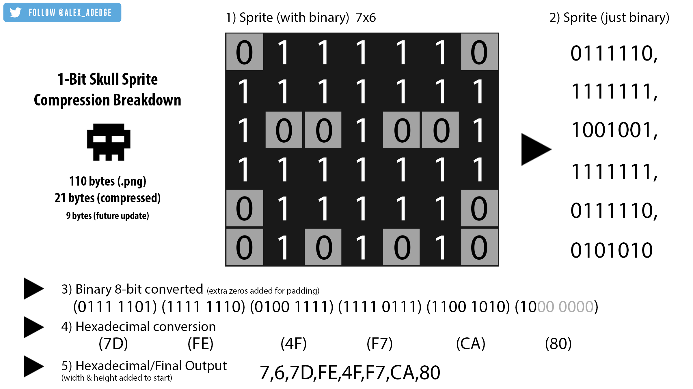

# js13k_2021
Repository for my 2021 #js13k game entry - SUBSPACE ZERO

## POST MORTEM

### Inspiration/Idea 
Generally every gamejam I participate in I try to focus on a certain idea or feature thats been bouncing around my head. 
Seeing this years JS13K coming up it reminded me of what I *attempted* last year in my first js13k - which was a pixel art isometric game that would generate its own pixel art from super-compressed data files.
Safe to say I didnt get very far with that idea and quit the jam early. But I did at least get enough of that idea working in javascript to know it was possible. 
So then JS13K came along again, and the idea started buzzing around in my head again, until I decided I'd take another stab at it. 
And this year, even though I didnt finish a game worthy of submitting to a judged category - I did at least get this generated pixelart process working start to finish! (+ a few other things)

If youd like to see the entire breakdown of the generated pixel art, see this thread on twitter: 

//image example 

