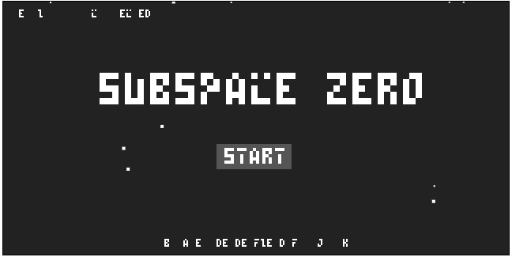
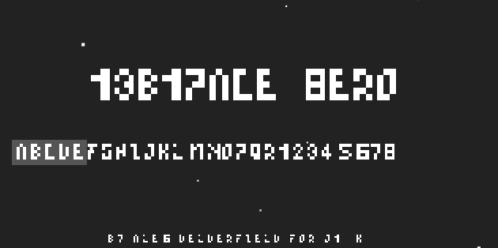
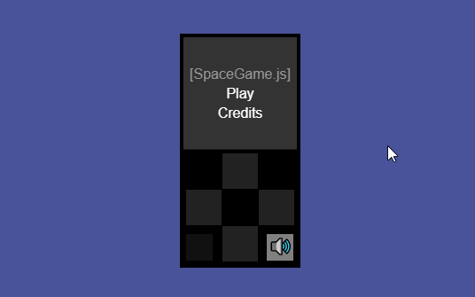
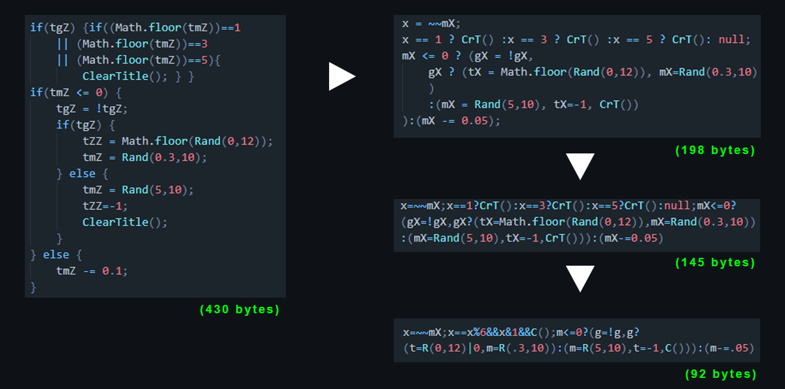

# js13k_2021
Repository for my 2021 #js13k game entry - SUBSPACE ZERO

## POST MORTEM

### Inspiration/Idea 
Generally every gamejam I participate in I try to focus on a certain idea or feature thats been bouncing around my head. 
Seeing this years JS13K coming up it reminded me of what I *attempted* last year in my first js13k - which was a pixel art isometric game that would generate its own pixel art from super-compressed data files.
Safe to say I didnt get very far with that idea and quit the jam early. But I did at least get enough of that idea working in javascript to know it was possible. 
So then JS13K came along again, and the idea started buzzing around in my head again, until I decided I'd take another stab at it. 
And this year, even though I didnt finish a game worthy of submitting to a judged category - I did at least get this generated pixelart process working start to finish! (+ a few other things)

If youd like to see the entire breakdown of the generated pixel art process, see this thread on twitter as I wont be going into huge detail here (plus theres a bunch of videos/gifs posted in the twitter thead): **https://twitter.com/Alex_ADEdge/status/1440918766058020867**

Slide from the multi-colour compression step in the process:

Slide from the 1-bit compression step in the process:

## Heres what worked and what didnt:

### Problems

* Complexity/Scope: My usual issue in gamejams - setting a realistic goal and sticking to it. So yeh in hindsight attempting multiplayer was a bad idea this year & I should have focused on a simpler single player game with this pixel art system as a neat bonus. That became apparant pretty quick. If I haddnt put so much time into working out the multiplayer code right in the middle of the jam, I probably would have pivoted away from that and made a single player game, but towards the end of the gamejam I committed to the multiplayer idea and tried to make it work. 

* Bugs: Along with the scope of the game and complexity being so high it just lead to a lot of hours being burnt chasing bugs. This was especially bad in the final few days when I really needed to be working-on/finishing the gameplay & code-golfing, but was instead tracking down  issues which took many hours to debug.

* Byte compression: The final submission came in at around 17kb, and thats with most of the incomplete combat code removed. I clearly needed a spare day or two at the end of the gamejam to focus on optimisations and compressing the code wherever possible.

I dont think '13B1PACE 8ERO' is the title... but close try.

### Wins 

* Pixel art compression & generation system: Clearly the focus of this gamejam, since Ive mentioned and tweeted about it so many times, but this really was the #1 goal other than actually finishing a game. And it turned out pretty well! See the twitter-thread breakdown mentioned previously for more details, and the 'whats next' section coming up to see what Im doing with this next.

* Projects & Practice: I worked on several different areas during the jam, + one mini-game prior to the jam as a warmup/learning-expereience for both KontraJS and javascript. All together this was a ton of learning and experience! I havent worked with javascript for gamedev a whole lot until the 2020 js13k gamejam, so working all all of these elements was a whole lot of learning. 
 
The projects were:
   * [minPIX](https://github.com/AD-Edge/minPIX) - The pixel editor Ive developed for compressing pixel art, started just before the jam and was properly exporting compressed pixel art towards the end of the jam, this is also where I experimented with and developed the decompiling and rendering code for the graphics I ended up with
   * [TestMultiplayer](https://github.com/AD-Edge/TestMP) - Test multiplayer code, based on the example provided by js13k and expanded to include multiplayer movement around a grid structure, I also started on the combat game loop here but didnt get too far with it in the gamejam
   * Isometric pixel art (this repo) - Started out as a graphical isometric test, I reworked the isometric platformer I attempted to make for the 2020 js13k. Initially I started out with image sprites, but towards the end of the jam I worked in my system for compressed pixel art, then revamped everything when I added in the multiplayer code from the TestMultiplayer project. Overall lots of experimenting and learning about creating an isometric game with a 2D game engine - which turned into the final resulting game. 
   * [Space Game](https://github.com/AD-Edge/SpaceGameTest) - The pre-gamejam game I worked on, tried to make it a neat demo which had many elements of a complete game, from UI to Sprites, multi-platform controls and sfx & music.

* Code-Golf: Not something Ive properly attempted before, but Ive always appreciated the idea of code-golfing (making functional code with the fewest possible characters/processes possible, ie like in golf how youre meant to sink the ball in as few shots as possible)
I was able to learn a few neat tricks and at least got hands on with some of this process, which was pretty rewarding and something I certainly want to get into more in future.

### Overall
-adding soon- 

### Whats Next 
-adding soon- 
